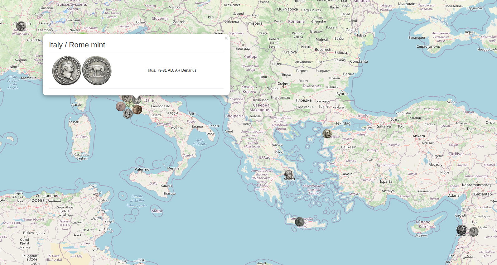
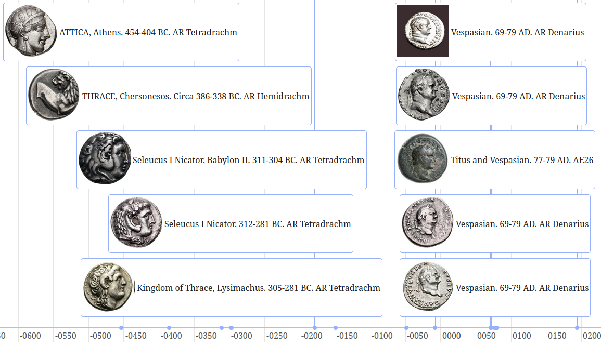

# OpenNumismat Tools

## open-numismat-map

Display your [OpenNumismat](https://github.com/OpenNumismat) collection on a map.



Each coin must have the following attributes set:

- longitude
- latitude
- obverseimg

### Usage

```
$ ./open-numismat-map --db coins.db && firefox index.html 
```

#### Customize Popup

##### HTML

```
$ ./open-numismat-map \
    --db coins.db \
    --popup-html '<center></center>' \
    && firefox index.html
```

##### HTML File

```
$ ./open-numismat-map \
    --db coins.db \
    --popup-file map/popups/simple.html \
    && firefox index.html
```

#### Layer Control

```
$ ./open-numismat-map --db coins.db --layer period && firefox index.html
```

## open-numismat-photos

A tool to fixing up photos in your [OpenNumismat](https://github.com/OpenNumismat) collection.

Ancient coin images typically contain the obverse and the reverse in a single image. `open-numismat-photos` can be used to split images into separate obverse and reverse photos to be set in the OpenNumismat database.

### Usage

Read in a photo from the path, vertical split it and save the left side to a file.

```
$ ./open-numismat-photos --in-path ./test.jpg --out-path ./test_split.jpg --translate vsplitl
```

Read in a photo from the URL, vertical split it and save the left side to a file.

```
$ ./open-numismat-photos --in-path ./test.jpg --out-path ./test_split.jpg --translate vsplitl
```

Use the OpenNumismat database field `photo1`, vertical split it and take the left image and set it as the database field `obverseimg`.

```
$ ./open-numismat-photos --db coins.db --coin-id 1 --in-field photo1 --out-field obverseimg --translate vsplitl
```

Use the OpenNumismat database field `photo1`, vertical split it and take the right image and set it as the database field `reverseimg`.

```
$ ./open-numismat-photos --db coins.db --coin-id 1 --in-field photo1 --out-field reverseimg --translate vsplitr
```

Bash one-liner to fix all obverse and reverse for coin ids 1 through 20.

```
DB=coins.db; for coin_id in $(seq 1 20); do ./open-numismat-photos --db $DB --coin-id $coin_id --in-field photo1 --out-field obverseimg --translate vsplitl; ./open-numismat-photos --db $DB --coin-id $coin_id --in-field photo1 --out-field reverseimg --translate vsplitr; done
```

## open-numismat-print

A tool to quickly print your [OpenNumismat](https://github.com/OpenNumismat) collection to the console.

### Usage

Read in a photo from the path, vertical split it and save the left side to a file.

```
$ ./open-numismat-print --db coins.db
```

## open-numismat-timeline

Display your [OpenNumismat](https://github.com/OpenNumismat) collection in a timeline.



Each coin must have the following attributes set:

- longitude
- latitude
- obverseimg

### Usage

```
$ ./open-numismat-timeline --db coins.db && firefox index.html 
```
