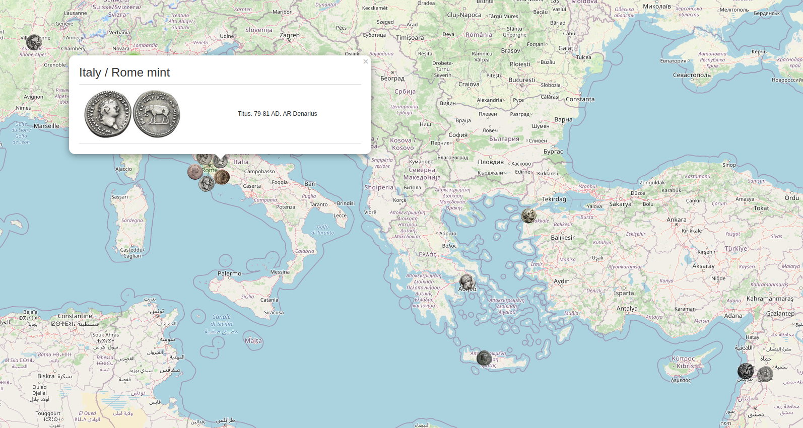

# OpenNumismatic Map

Display your [OpenNumismatic](https://github.com/OpenNumismat) collection on a map.



Each coin must have the following attributes set:

- longitude
- latitude
- obverseimg

## Usage

### Basic

```
$ ./open-numismatic-map --db /path/to/coins.db && firefox index.html 
```

### Customize Info

```
$ ./open-numismatic-map --db /path/to/coins.db --fields photo1,title,unit,year,grade,rarity && firefox index.html
```

### Layer Control

```
$ ./open-numismatic-map --db /path/to/coins.db --layer period && firefox index.html
```

## OpenNumismatic Photos

Ancient coin images typically contain the obverse and the reverse in a single image. `open-numismatic-photos` can be used to split images into separate obverse and reverse photos to be set in the OpenNumismatic database.

```
# Read in a photo from the path, vertical split it and save the left side in another paths 
$ ./open-numismatic-photos --in-path ./test.jpg --out-path ./test_split.jpg --translate vsplitl

# Read in a photo from the URL, vertical split it and save the left side in another paths 
$ ./open-numismatic-photos --in-path ./test.jpg --out-path ./test_split.jpg --translate vsplitl

# Use the OpenNumismatic database field "photo1", vertical split it and take the left image and set it as the database field "obverseimg"
$ ./open-numismatic-photos --db /path/to/coins.db --coin-id 1 --in-field photo1 --out-field obverseimg --translate vsplitl

# Use the OpenNumismatic database field "photo1", vertical split it and take the right image and set it as the database field "reverseimg"
$ ./open-numismatic-photos --db /path/to/coins.db --coin-id 1 --in-field photo1 --out-field reverseimg --translate vsplitr

# Fix all obverse and reverse for coin ids 1 through 14
for coin_id in $(seq 1 14); do ./open-numismatic-photos --db /path/to/coins.db --coin-id $coin_id --in-field photo1 --out-field obverseimg --translate vsplitl; ./open-numismatic-photos --db /path/to/coins.db --coin-id $coin_id --in-field photo1 --out-field reverseimg --translate vsplitr; done
```
